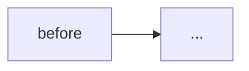

<!--
PR 単位の規律を満たすための構造チェック。埋められない欄がある場合は PR 単位を見直すか
DRAFT のまま残す。

参考: https://zenn.dev/nttdata_tech/articles/8a010aff542625
(AI-native 開発で欠けやすい: テスト観点・PR 単位・仕様の明示・デグレ検出)

ベース: ProtoShip リポジトリの PULL_REQUEST_TEMPLATE.md。AWS / harness / synth 関連を
本リポジトリの構成に合わせて落としてある。
-->

## このPR merge 後に何が動くようになるか

<!--
1 文。ユーザー観察可能な動作で書く。「DB に列が追加される」ではなく
「ユーザーが /settings からアバター画像を設定できる」のような、end-user / operator が
確認できる振る舞いで書く。

「動く」= 商用運用に耐える状態。デモのためのハリボテ / 雑な MVP ではない。
小さい scope であっても、テストされていて意図が明確で、そのまま本番に出しても
壊れないレベルまで詰める。

書けない場合は PR 単位が適切でない。value を出す PR と束ねるか、rebase で順序を整えること。
-->

## なぜ今これが要るか

<!-- 2-3 文。無いと何に困るか、他の解との比較、優先度の根拠 -->

## 変更前 → 変更後のフロー

<!--
mermaid で実行経路の差分。consumer を全部描く。
API 呼び出しの順序、データの流れ、失敗時の経路を可視化する。
-->

## 物理影響

### ビルド成果物 (`make build`)

<!--
package ごとの成果物を列挙する。「変更なし」の場合も明示する (reviewer に推論させない)。
種別: 新規 / 既存ロジックのみ変更 / 依存追加 / 既存ファイル削除
-->

| パッケージ | 変更 |
|---|---|
| _例: packages/web_ | _ロジック変更のみ、API は不変_ |

### 依存パッケージの変更

<!-- bun.lock / package.json の依存変更を列挙する。「変更なし」も明示する -->

| パッケージ | 種別 (追加 / 更新 / 削除) | バージョン | 理由 |
|---|---|---|---|
| _例: zod_ | 追加 | _3.x_ | _スキーマ検証_ |

## ファイルごとの変更意図

<!-- 全ファイル 1 行ずつ。「何を」ではなく「なぜ」を書く。触ったファイル数が 10 を超えたら PR 分割を検討 -->

- `path/to/file.ts` — _変更意図_

## Regression 分析

<!--
merge で壊しうる既存挙動を列挙する。未確認項目がある PR は DRAFT のまま残す。

確認方法は具体的に書く: grep / code read / test run / 実環境観察 など。
「テストが通った」だけでは Regression 分析にならない。テストが existing behavior を
カバーしているか自体を確認する必要がある。
-->

| # | 壊れうる既存挙動 | 影響範囲 | 確認状態 | 確認方法 / 対処 |
|---|---|---|---|---|
| 1 | _例: 既存 API のレスポンス形式_ | _例: /api/users の consumer_ | ✅ 確認済み / ❌ 未確認 | _grep で全 caller を列挙: ..._ |

## Rollback 手順

<!-- この PR を revert したら何が起こるか、手順を書く。データ / サイドエフェクトの fate も明記 -->

1. `git revert <merge-sha>` → 新 PR で main に戻す
2. _再 deploy / 再 build が必要なら手順を記載_
3. _既に発生したデータ / サイドエフェクトの fate: ..._

## テスト戦略

<!--
この PR で touch したコードに対するテスト観点を宣言する。
既存テストがカバーする範囲 / 新規テストで追加した観点 / 未カバー観点を明示。

CLAUDE.md の実装原則に従う:
  - TDD: テストを先に書く (Red → Green → Refactor)
  - BDD: describe / it を日本語で書き振る舞いを表現
  - No Mock: 実際の DB / API / ファイル I/O を使う
  - カバレッジ 100% を維持する

AI に丸投げで生成したテストは、実行パスを本当にカバーしているか必ず確認すること
(article の指摘: AI 生成テストは claim した code path を実際に exercise していない
ケースがある)。
-->

- 既存テストでカバーされる観点 — _列挙_
- このPRで追加したテスト — _ファイル名 + 観点_
- 未カバー (受容する理由) — _例: 実環境でしか確認できない部分は `## Verification (merge 後)` に回した_

## Verification

### Merge 前 (DRAFT 解除条件)

- [ ] `make test`
- [ ] `make typecheck`
- [ ] `make lint`
- [ ] `make format_check`
- [ ] `make build`
- [ ] Regression 分析の未確認がゼロ
- [ ] merge で動くようになる機能を 1 文で書けている

### Merge 後 (deploy / 反映後 signal)

- [ ] _検証コマンド / 観察 signal_
- [ ] _tear-down で元に戻せるか (dev 環境)_

## 既知の未完了 (scope 外)

<!-- この PR で解決しない既知問題。scope から除外した理由、後続 issue / PR 案を明示 -->

- _項目 1_ — _後続 PR で対処予定 / 別 issue_
